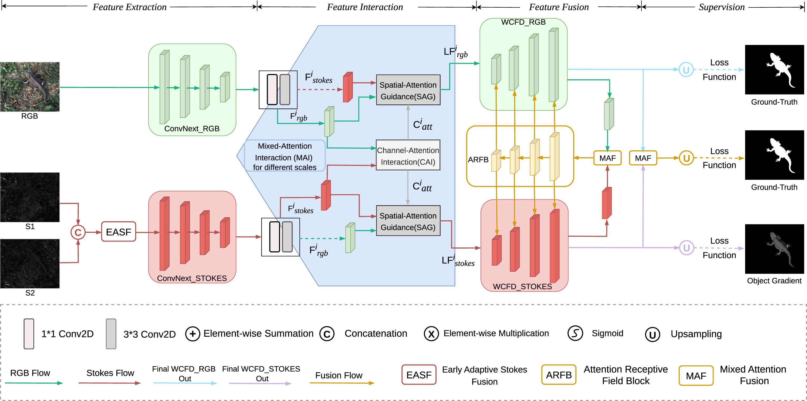
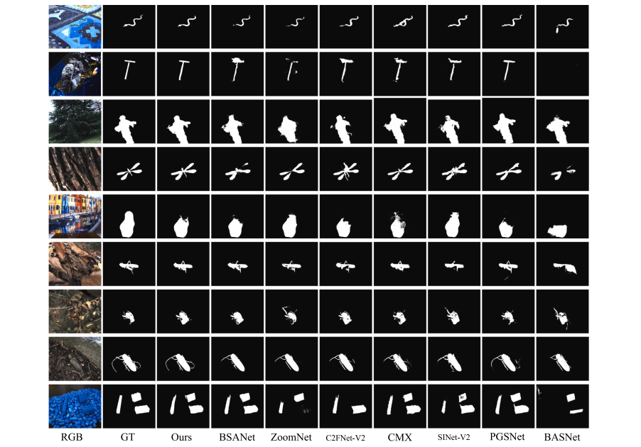
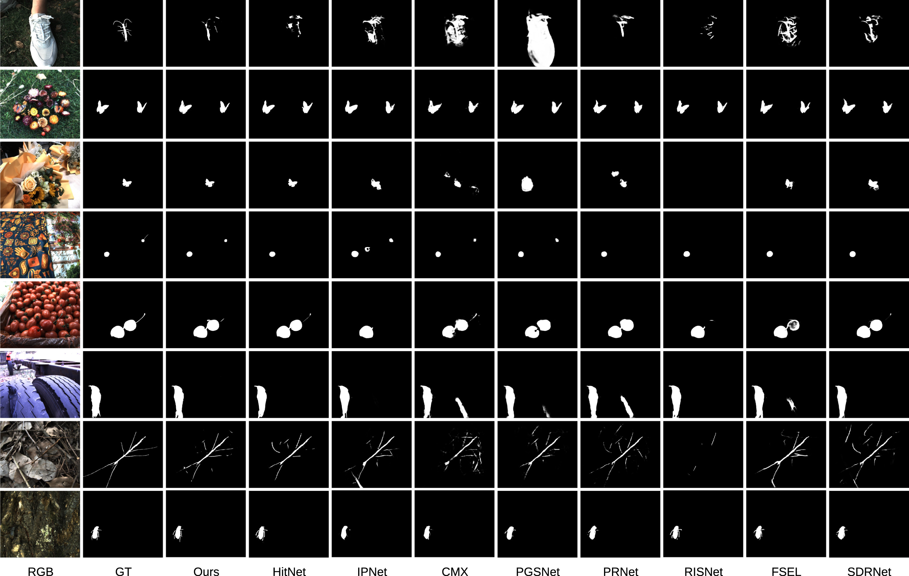

# Downloading necessary data:
* The PCOD_1200 dataset can be found in this [download link (Google Drive)](https://drive.google.com/uc?export=download&id=1cflvU9lAHaRFppMKlD0UG4xVNTkHVh6s)

* Four images with different polarization angles can be found in this [download link (Google Drive)](https://drive.google.com/uc?export=download&id=1ykmaK9eFCJBWz7qE1TWM8-g9f0cj9WIj).

# IPNet: Polarization-based Camouflaged Object Detection via dual-flow network
### Authors: Xin Wang, Jiajia Ding, Zhao Zhang, Junfeng Xu and Jun Gao.
The paper was accepted by Engineering Applications of Artificial Intelligence on 12 October, 2023. The paper link is : - [Link](https://doi.org/10.1016/j.engappai.2023.107303).
# Polarization-based Camouflaged Object Detection with high-resolution adaptive fusion Network
### Authors: Xin Wang and Junfeng Xu and Jiajia Ding.
The paper was accepted by Engineering Applications of Artificial Intelligence on 5 February, 2025. The paper link is : - [Link](https://doi.org/10.1016/j.engappai.2025.110245).

## Network Architecture
### The network architecture of IPNet

### The network architecture of HIPFNet

## Results
### The results of IPNet

### The results of HIPFNet

## Content Description
### Prerequisites
* Python 3.9
* Pytorch 1.12.0
* Torchvision 0.13.0
* Numpy 1.26.4
### Training/Testing
* The training and testing experiments are conducted using PyTorch with a single NVIDIA 3090ti GPU of 24 GB Memory.
* Please run
```
MyTest.py
```
### Code:
* unpolar_rgb.m/untitled2.m/AOP_DOP_new.m: Stokes parameter image computation in MATLAB, with input consisting of four images 

  at different polarization angles. Specific differences are detailed in the code.

* data_enhance.py: Data Augmentation, Augment the images in the dataset by horizontally and vertically flipping them.

* convert.py: Process the JSON files generated after using LabelMe for ground truth annotation for subsequent processing.

* Get_gt_from_json.py: Convert the output from the above convert.py script into a binary image (black and white).

* sal2edge:Generate object edges using Ground Truth(GT).

## Citation
```
@article{WANG2024107303,
title = {IPNet: Polarization-based Camouflaged Object Detection via dual-flow network},
journal = {Engineering Applications of Artificial Intelligence},
volume = {127},
pages = {107303},
year = {2024},
issn = {0952-1976},
doi = {https://doi.org/10.1016/j.engappai.2023.107303},
author = {Xin Wang and Jiajia Ding and Zhao Zhang and Junfeng Xu and Jun Gao},
}

@article{WANG2025110245,
title = {Polarization-based Camouflaged Object Detection with high-resolution adaptive fusion Network},
journal = {Engineering Applications of Artificial Intelligence},
volume = {146},
pages = {110245},
year = {2025},
issn = {0952-1976},
doi = {https://doi.org/10.1016/j.engappai.2025.110245},
author = {Xin Wang and Junfeng Xu and Jiajia Ding},
}
```
